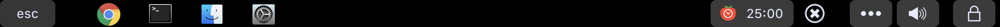
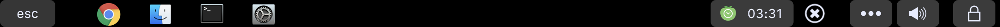
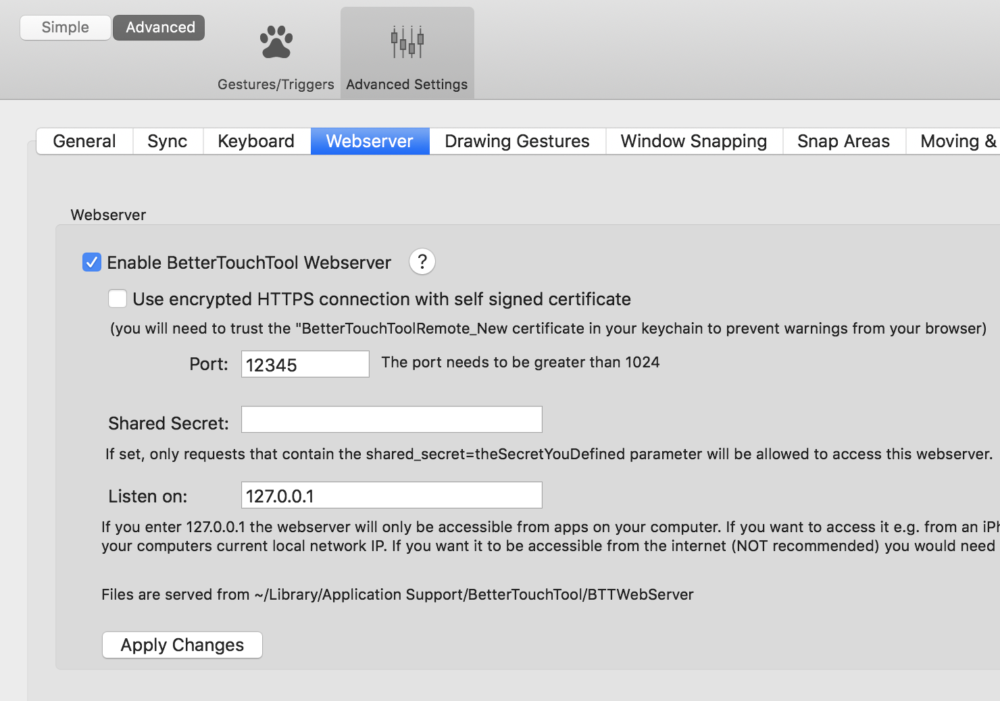
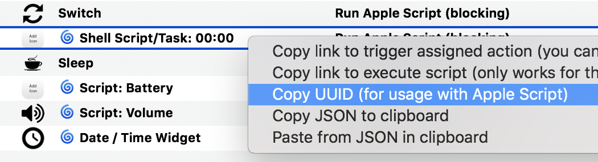

# Tomato

Tomato is a command for running [pomodoro](https://en.wikipedia.org/wiki/Pomodoro_Technique) in background. It's designed mainly to stay in MacBook touchbar.

For example, my touchbar looks like this:

##### 1. Start

- **First button**: Tap to start.
- **Second button**: Tap to switch between **work** and **break** mode.



##### 2. Working (running)

- **First button**: Tap to pause/continue.
- **Second button**: Tap to skip the current interval.


##### 3. Short Break (running)

- **First button**: Tap to pause/continue.
- **Second button**: Tap to skip the current break interval.



### Modes:
- **Work**: The timer is running in working interval (25 mins).
- **Short Break**: The timer is running in short break interval (5 mins).
- **Long Break**: The timer is running in long break interval (15 mins). After a set of pomodoro (default to 4), a longer break is taken.

## Quick Start

1. Download the [prebuilt command](others/tomato) or [build from source](#build-from-source).

2. Config BetterTouchTool as this screenshot (`port=12345`). Don't forget to click **Apply Changes**.

    

3. Config touchbar buttons with these Apple scripts:
    - **Polling**: Display information on the first button.
    - **Start/Pause**: Run when the first button is tapped.
    - **Stop/Switch Mode**: Run when the second button is tapped.

    Or copy config for [the widget](https://raw.githubusercontent.com/ng-vu/tomato/master/others/btt-widget.json) and [the button](https://raw.githubusercontent.com/ng-vu/tomato/master/others/btt-button.json) then press `Command+V` inside BetterTouchTool.

4. Copy `UUID` of the widget

    

4. Start the `tomato` server. It will listen on `:12321` by default.

    ```
    tomato -uuid=[UUID] -port=12345 -icon1=red.png -icon2=green.png
    ```

## Build from source

1. Install [Go](https://golang.org/doc/install)
2. `go build tomato.go`

## API

| API                                         | Sample Output               |Description
|---------------------------------------------|-----------------------------|-----------
| GET [/status](http://localhost:12321/status)| `[R] 17:43 1/3 work`        | Current status
| GET [/time](http://localhost:12321/time)    | `17:43`                     | Current timer
| POST /action/start                          | `17:43`        | Start/pause the current interval.
| POST /action/stop                           | `25:00` | Stop the current interval or switch mode.

### Output

1. State: `[S]` - stopped, `[R]` - running, `[P]` - paused.
2. Timer: `mm:ss` - work interval, `mmːss` - break interval.
3. Number of completed pomodoro in a set.
4. Mode: `work`, `short-break`, `long-break`.

### JSON

```bash
curl -H "Accept: application/json" http://localhost:12321/status
```

```
{"i":0,"mode":"work","n":4,"state":"[S]","timer":"25:00"}
```

## AppleScript

### 1. Polling

```applescript
try
    set reqURL to "http://localhost:12321/time"
    do shell script "curl " & quoted form of reqURL
on error
    return "00:00"
end try
```

### 2. Start / Pause

```applescript
try
    set reqURL to "http://localhost:12321/action/start"
    do shell script "curl -X POST " & quoted form of reqURL
end try
```

### 3. Stop / Switch Mode

```applescript
try
    set reqURL to "http://localhost:12321/action/stop"
    do shell script "curl -X POST " & quoted form of reqURL
end try
```

## Notes

- [BetterTouchTool](https://www.boastr.net/) to customize the touchbar. It's an awesome app!
- [Automator](https://stackoverflow.com/questions/6442364/running-script-upon-login-mac) to start the script at login.

# License

- [MIT License](https://opensource.org/licenses/mit-license.php)
